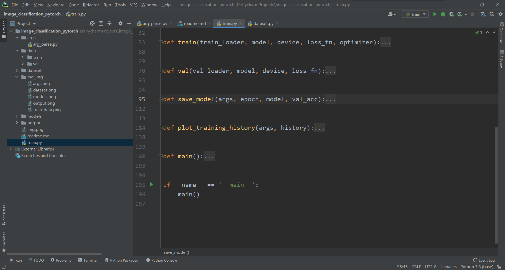
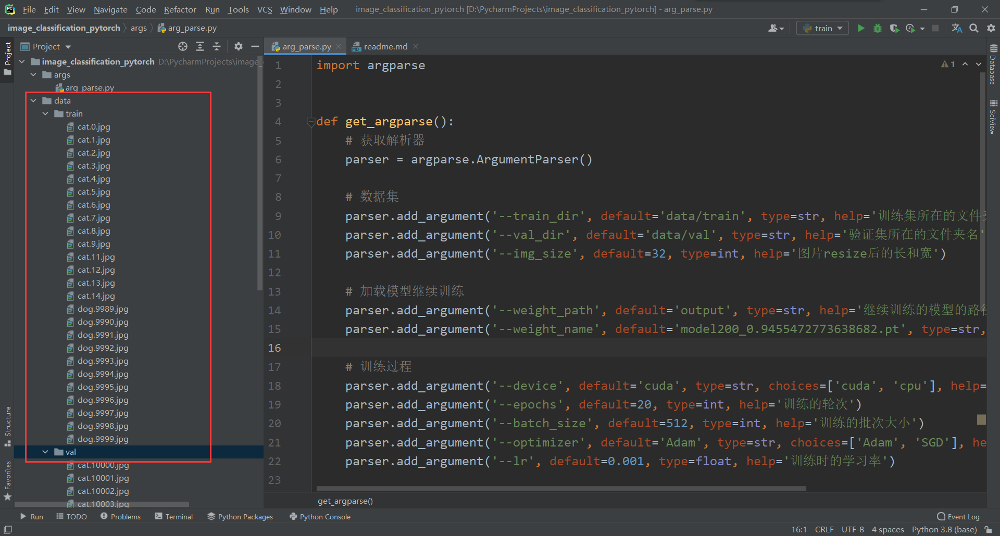
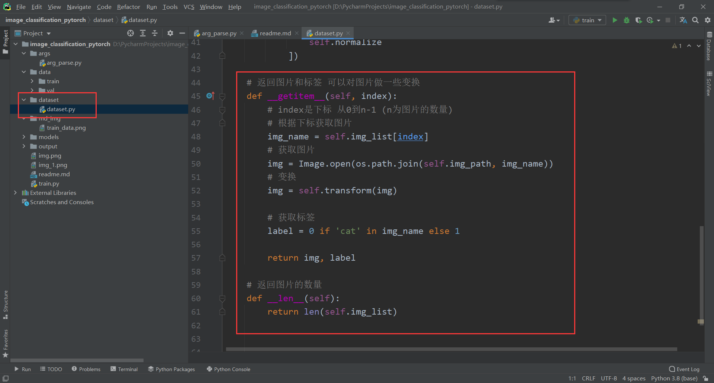
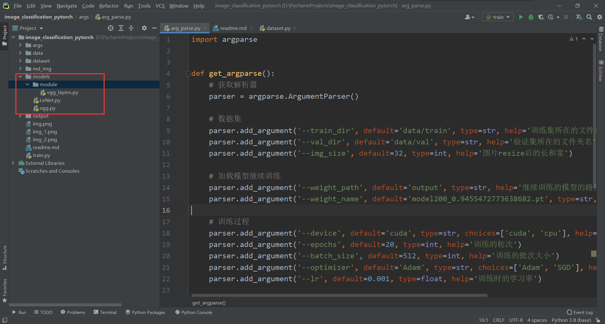
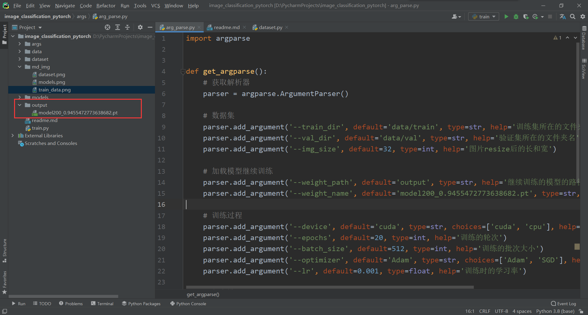
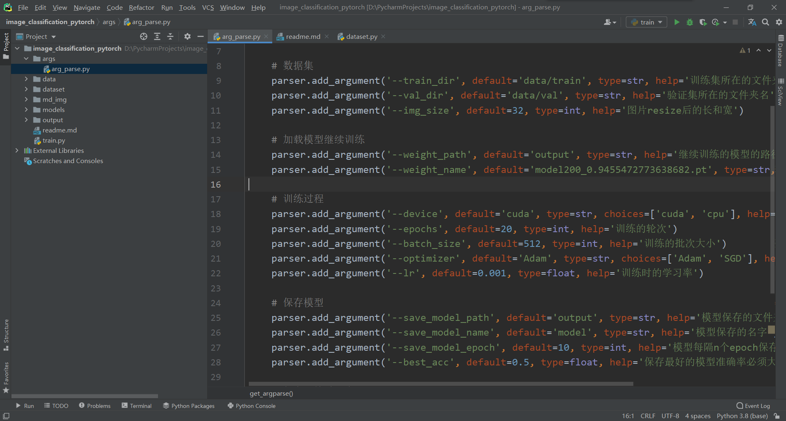

# 图像分类

### 0、介绍
- 代码使用pytorch实现
- 代码只适合新手学习
- 让新手学习使用和习惯使用argparse
- 代码在train.py将各个部分封装成函数，方便理解、调用和修改

### 1、训练的数据
图片放在data/train和data/val文件夹下面

### 2、根据自己的图片数据修改文件
修改dataset/dataset.py中的类，或者自己创建一个类

### 3、创建模型
可以使用models下的vgg和lenet，也可以自己写一些其他的模型

### 4、模型保存
训练好的模型会保存在output文件夹下，默认保存最好和最后一个模型，且每隔10epoch（可以修改这个参数）就保存一次模型。然后也可以加载模型继续训练

### 5、修改超参数
根据自己显卡大小等修改超参数

### 6、如何训练
- 使用命令行：`python train.py --train_dir data/train --val_dir data/val`
- 或右键运行train.py
- 补充：使用命令行时要适当增加参数或者更改默认值